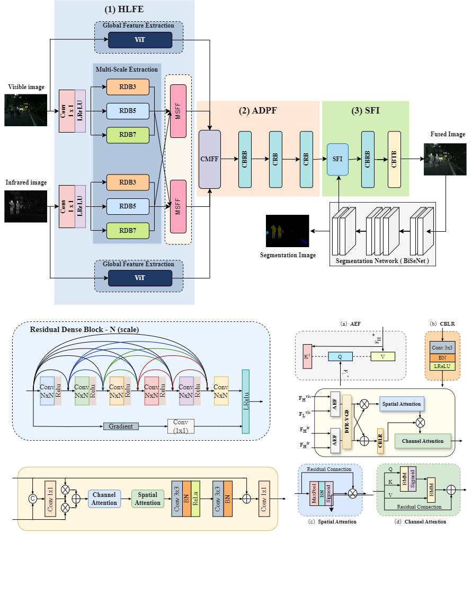

# MDDPFuse
The code of "MDDPFuse: Multi-Driven Dynamic Perception Network for Infrared and Visible Image Fusion via  Data Guidance and Semantic Injection"

## Recommended Environment
- [] torch 1.7.1
- [] torchvision 0.8.2
- [] numpy 1.19.2
- [] pillow 8.0.1

## Network Architecture



## If this work is helpful to you, please cite it as：
```
@article{Wang2025MDDPFuse,
  author = {Wang, M. and Pan, Y. and Zhao, Z. and others},
  title = {MDDPFuse: Multi-driven dynamic perception network for infrared and visible image fusion via data guidance and semantic injection},
  journal = {Knowledge-Based Systems},
  year = {2025},
  doi = {10.1016/j.knosys.2025.114027}
}

```

## Acknowledgements

This code is built on [SeAFusion](https://github.com/Linfeng-Tang/SeAFusion). We thank the authors for sharing their codes.
